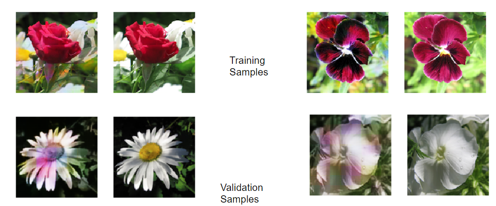
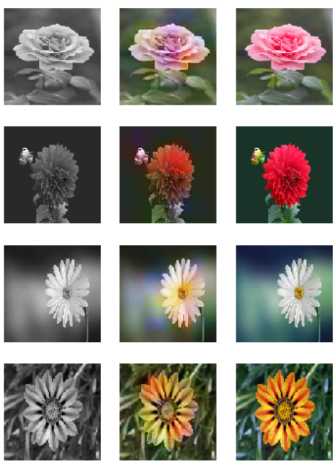
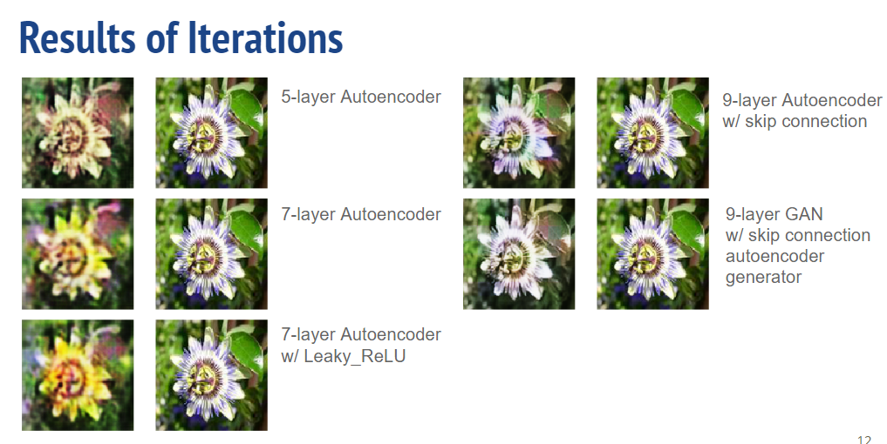

# Colorizing-Images

## Purpose
The goal of the project was to design a machine learning model that can colorize grayscale images in a plausible manner. To simplify the complexity of the images while allowing for a broad range of colours, the model was trained on grayscale/RGB pairs of flower images. The training data can be seen in the flower images.zip file.

## Final Model Architecture

In this project, we iterated on different models (CNN, Autoencoders, and GANs) and the final architecture is a GAN with a convolutional neural network (CNN) as discriminator and Autoencoder as the generator. 

Downsampling is achieved using a stride of 2 in the encoder’s convolutional layers. Poolings are not used due to their impact on the stability of GAN. Each encoder layer except the first doubles the number of feature maps and batch normalize the output. An embedding dimension of (16, 16, 512) is produced. Upsampling is achieved using a combination of skip connections and transposed convolutional layers. The ResNet style skip connection in conjunction with ReLU activation is implemented.

The layout of the final GAN architecture can be seen below:

Due to the fragile stability of GAN, regularization methods in both the architecture and the training function are non-trivial. In the training function, a threshold accuracy for the discriminator is set such that the discriminator is not trained when the accuracy is above the threshold. Noises are fed to the discriminator every 5th epoch to improve its generalizing capacity. The loss of the generator is modified to be a combination of binary cross-entropy loss from the flipped labels and L1 loss from the original colored images.

## Saved Weights and Demo

Weights from our training iterations are saved in the Train_weights directory. The Demo.ipynb notebook integrates all the data processing pipeline so all a user has to do is paste the link of an image they want to colorize. The function converts the image to grayscale (if the linked image is RGB), runs it through the model with the final weights, and then outputs the final colorized image.

## Results

The results of the model on the training and validation data can be seen below with the model generated images on the left and the original image on the right. 

To test the generalization of the model we tested the model out on random flower images on Google. On the left we have the grayscale conversion, on the middle we have the generated image and on the right, we have the original image

In order to examine the gradual improvement of the models in the different iterations, the saved weights from each model were used on the same image to examine the difference of throughout the project.

